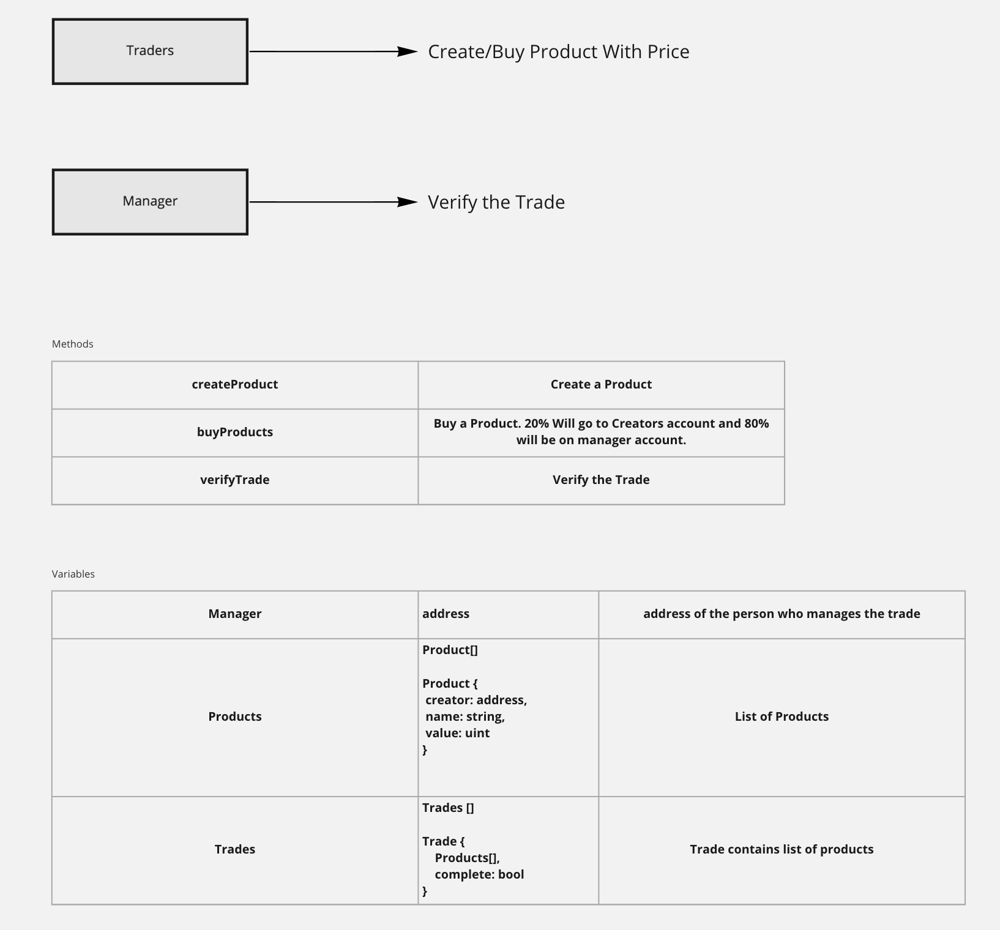

# Trading smart contract demo

## Contract to demonstrate product trading on Ethereum
Smart contracts involve a manager, sellers, and buyers. Sellers can create products and buyers can buy them. At the time of purchase, the buyer pays the full amount, and 20% goes to the seller's account, and 80% goes to the manager's account. The seller receives 80% of the sale price once manager approves it.

## Design
